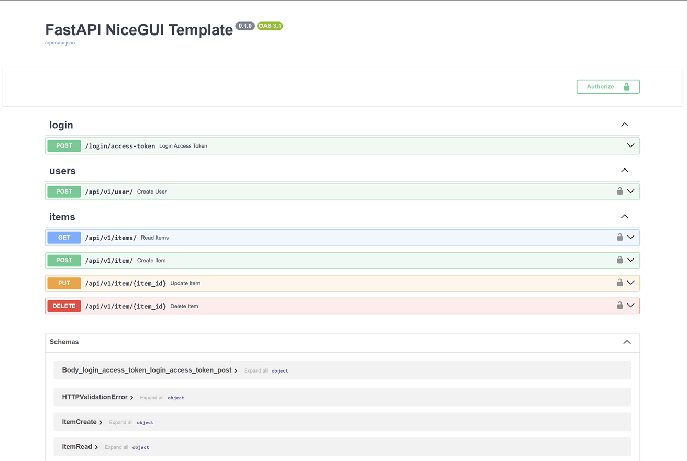

# FastAPI and NiceGUI Full-Stack


KHÔNG AI PUSH THẲNG LÊN MAIN NHÉ :33


## Getting Started

Follow these instructions to get the project running on your local machine.

### Prerequisites

- Python 3.10+
- Docker and Docker Compose
- Git

### Setup Instructions

1.  **Create a Virtual Environment and Install Dependencies**

    a. **Create and Activate a Virtual Environment**

    ```bash
    # Create the virtual environment
    python -m venv venv

    # Activate it (on macOS/Linux)
    source venv/bin/activate

    # Or activate it (on Windows)
    .\venv\Scripts\activate
    ```

    b. **Install Dependencies**

    ```bash
    pip install -r requirements.txt
    ```

2.  **Configure Environment Variables**

    Create a `.env` file in the project root by copying the example file.

    ```bash
    cp .env.example .env
    ```

    You can modify the `.env` file if needed, but the default values are configured to work with the Docker Compose setup.

3.  **Run the Application**
    Start the development server by executing the `app.py` script directly from your terminal.

    ```bash
    python app.py
    ```

    This command calls the `ui.run()` function at the bottom of the script, which starts the web server. Because the `reload=True` parameter is used, the server will automatically restart whenever you make code changes.

### Accessing the Application

Once the server is running, you can access the following URLs:

**Application Frontend**: [http://localhost:8000](http://localhost:8000)

- The main user interface built with NiceGUI.


**API Docs (Swagger UI)**: [http://localhost:8000/docs](http://localhost:8000/docs)

- Interact with and test the API endpoints directly from your browser.



**Alternate API Docs (ReDoc)**: [http://localhost:8000/redoc](http://localhost:8000/redoc)

- View a clean and concise API documentation.


### Stopping and Cleaning Up

When you are finished, you can stop the services and clean up the environment.

1.  **Stop the Uvicorn Server**
    Press `Ctrl+C` in the terminal where the application is running.

2.  **Deactivate the Virtual Environment**
    ```bash
    deactivate
    ```

