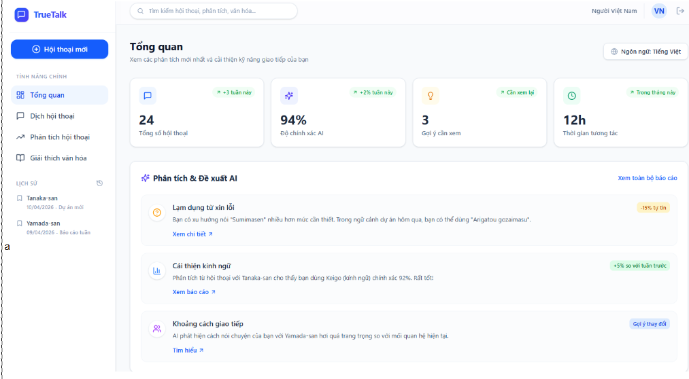

# ID1 Screen

## Purpose
This screen is the overview dashboard for TrueTalk. It provides global navigation, search, activity statistics, and AI-generated suggestions.

## UI Elements and Behavior
| No | 項目名称 / Ten muc | 項目説明 / Mo ta | 分類 / Phan loai | 選択肢・入力値 / Lua chon - Gia tri nhap | 処理内容 / Xu ly | 備考 / Ghi chu |
| --- | --- | --- | --- | --- | --- | --- |
| 1 | 検索バー / Thanh tim kiem | 検索キーワードを入力する / Nhap tu khoa de tim kiem | テキスト / Van ban | 任意のテキスト / Van ban bat ky | 入力されたキーワードに基づき、会話や文化情報を検索する。 / Tim kiem dua tren tu khoa da nhap | 入力欄に検索履歴がある / Co lich su tim kiem trong o nhap |
| 2 | アプリロゴ / Logo ung dung | アプリの識別を表示する / Hien thi nhan dien ung dung. | 画像 / Hinh anh | なし / Khong | クリックするとダッシュボードに遷移する。 / Nhan de quay lai Dashboard. | "全画面共通 Dung chung cho toan he thong" |
| 3 | 新規会話ボタン / Nut Hoi thoai moi | 会話を開始するボタン / Nut bat dau cuoc hoi thoai | ボタン / Nut bam | クリック / Nhan | 新しい録音・入力画面を開く。 / Mo man hinh ghi am hoac nhap lieu moi. | クリックすると、会話翻訳画面に遷移します。 / Bam vao se chuyen sang man hinh Dich hoi thoai |
| 4 | メインメニュー / Menu chinh | 機能のナビゲーション / Dieu huong cac tinh nang chinh. | テキスト / Van ban | 総覧、翻訳、分析、文化 / Tong quan, Dich, Phan tich, Van hoa | 各機能の画面へ遷移する。 / Chuyen huong den cac man hinh tinh nang tuong ung. | - |
| 5 | 履歴リスト / Danh sach lich su | 最近の対話相手を表示する / Hien thi doi tac gan day. | テキスト / Van ban | 対話相手の名前 / Ten nguoi doi thoai | 過去の履歴詳細画面へ遷移する。 / Chuyen den man hinh chi tiet lich su. | - |
| 6 | 画面タイトル / Tieu de man hinh | 現在の画面名を表示する / Hien thi ten man hinh hien tai. | テキスト / Van ban | "概要" / "Tong quan" | 現在の画面の目的を表示する。 / Hien thi muc dich cua man hinh hien tai. | - |
| 7 | 言語選択 / Chon ngon ngu | システム言語を変更する / Thay doi ngon ngu he thong. | ボタン / Nut bam | 日本語、ベトナム語 / Tieng Nhat, Tieng Viet | 選択された言語にインターフェースを切り替える。 / Chuyen doi ngon ngu giao dien. | - |
| 8 | 統計ダッシュボード / Thong ke tong quan | 活動指標を表示する / Hien thi cac chi so hoat dong. | テキスト / Van ban | 会話数、精度、提案数 / So cuoc goi, do chinh xac, goi y | DBからデータを取得し、活動の概要を表示する。 / Lay du lieu tu DB va hien thi tom tat hoat dong. | - |
| 9 | 会話総数カード / The Tong so hoi thoai | 総会話数を表示する / Hien thi tong so hoi thoai. | テキスト / Van ban | 数値 (24) / Con so (24) | 合計会話数を集計して表示する。 / Thong ke va hien thi tong so hoi thoai. | - |
| 10 | AI精度カード / The Do chinh xac AI | AIの分析精度を表示する / Hien thi do chinh xac cua AI. | テキスト / Van ban | パーセント (94%) / Phan tram (94%) | AIモデルの平均精度を表示する。 / Hien thi do chinh xac trung binh cua AI. | - |
| 11 | AIからの提案 / Goi y tu AI | AIによる提案アクションを表示する / Hien thi hanh dong goi y tu AI. | テキスト / Van ban | 提案アクション / Hanh dong goi y | 会話の内容を分析し、改善案を提示する。 / Phan tich noi dung va dua ra de xuat cai thien. | "スクロール可能 Co the cuon" |
| 12 | 交流距離の分析 / Phan tich khoang cach | 相手との心理的距離を表示する / Hien thi khoang cach giao tiep. | テキスト / Van ban | 距離指標 / Chi so khoang cach | 相手との関係性や丁寧さを分析し表示する。 / Phan tich va hien thi do than mat/lich su. | - |
| 13 | ログアウトボタン / Nut Dang xuat | アプリからログアウトする / Dang xuat khoi ung dung. | ボタン / Nut bam | - | ログイン画面に戻る / Quay tro lai man hinh dang nhap | ログアウトの警告を表示する / Hien thi canh bao dang xuat |

## Notes
- The bilingual labels above reflect the original UI specification in the image.
- Items marked as global appear across multiple screens.
