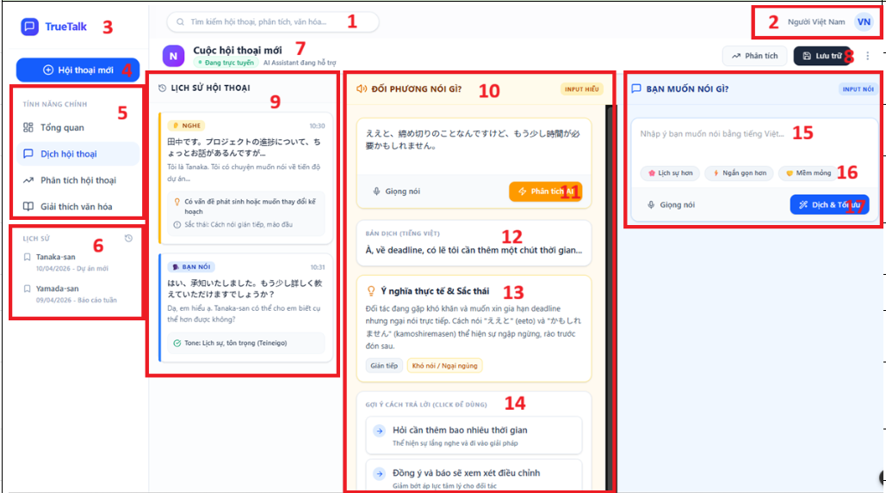

# ID2 Screen

## Purpose
This screen is the conversation translation workspace. It combines the conversation history, the partner's speech analysis, and the user's reply drafting with optimization controls.

## UI Elements and Behavior
| No | 項目名称 / Ten muc | 項目説明 / Mo ta | 分類 / Phan loai | 選択肢・入力値 / Lua chon - Gia tri nhap | 処理内容 / Xu ly | 備考 / Ghi chu |
| --- | --- | --- | --- | --- | --- | --- |
| 1 | 検索バー / Thanh tim kiem | 全体検索機能 / Chuc nang tim kiem tong the. | テキスト / Van ban | 任意のテキスト / Van ban bat ky | 入力されたキーワードで検索を実行する。 / Thuc hien tim kiem tu khoa. | 入力欄に検索履歴がある / Co lich su tim kiem trong o nhap |
| 2 | 言語選択 / Chon ngon ngu | 表示言語の切り替え / Chuyen doi ngon ngu hien thi. | ボタン / Nut bam | 日本語、ベトナム語 / Nhat, Viet | システムの表示言語を変更する。 / Thay doi ngon ngu hien thi he thong. | - |
| 3 | アプリロゴ / Logo ung dung | ホームへのリンク / Lien ket ve trang chu. | 画像 / Hinh anh | なし / Khong | クリックするとダッシュボードへ遷移。 / Nhan de ve trang Dashboard. | "全画面共通 Dung chung cho toan he thong" |
| 4 | 新規会話ボタン / Nut Hoi thoai moi | 新しいチャットの作成 / Tao cuoc hoi thoai moi. | ボタン / Nut bam | クリック / Nhan | 会話入力エリアをリセットし新規作成する。 / Reset vung nhap va tao moi hoi thoai. | "クリックすると、会話翻訳画面に遷移します。Bam vao se chuyen sang man hinh Dich hoi thoai" |
| 5 | メインメニュー / Menu chinh | 機能ナビゲーション / Dieu huong tinh nang. | テキスト / Van ban | 翻訳 (Active) / Dich (Dang chon) | 選択した機能画面へ遷移する。 / Chuyen den man hinh tinh nang duoc chon. | - |
| 6 | 履歴リスト / Danh sach lich su | 過去の会話ログ / Nhat ky hoi thoai cu. | テキスト / Van ban | 相手の名前 / Ten doi tac | 過去の会話内容を読み込む。 / Tai noi dung hoi thoai qua khu. | - |
| 7 | 会話タイトル / Tieu de hoi thoai | 現在の会話名と状態 / Ten va trang thai hoi thoai. | テキスト / Van ban | 会話名、ステータス / Ten, trang thai | 会話名と「オンライン」状態を表示する。 / Hien thi ten va trang thai "Truc tuyen". | - |
| 8 | 保存ボタン / Nut Luu tru | 会話内容の保存 / Luu noi dung hoi thoai. | ボタン / Nut bam | クリック / Nhan | 現在の会話をデータベースに保存する。 / Luu hoi thoai hien tai vao DB. | クリックすると、会話が履歴に保存されます Bam vao thi Hoi thoai se luu trong lich su |
| 9 | 会話履歴領域 / Vung lich su hoi thoai | やり取りのログ表示 / Hien thi nhat ky doi dap. | 〇表示領域 / Vung hien thi | 聞く、自分 / Nghe, Ban noi | 会話の流れを時系列で表示する。 / Hien thi luong hoi thoai theo thoi gian. | スクロール可能 / Co the cuon |
| 10 | 相手の発言領域 / Vung doi phuong noi | 相手の原文と分析 / Van ban goc va phan tich doi tac. | 〇表示領域 / Vung hien thi | 日本語原文 / Tieng Nhat goc | 相手の音声をテキスト化し表示する。 / Chuyen am thanh doi phuong thanh van ban. | スクロール可能 / Co the cuon |
| 11 | AI分析ボタン / Nut Phan tich AI | 意図の深掘り / Phan tich sau y dinh. | ボタン / Nut bam | クリック / Nhan | 発言の裏にある意図や感情を抽出する。 / Trich xuat y dinh va cam xuc sau loi noi. | - |
| 12 | 翻訳表示領域 / Vung hien thi ban dich | ベトナム語訳の表示 / Hien thi ban dich tieng Viet. | テキスト / Van ban | ベトナム語訳 / Ban dich tieng Viet | 原文を自然なベトナム語に翻訳する。 / Dich van ban sang tieng Viet tu nhien. | - |
| 13 | ニュアンス解説 / Giai thich sac thai | 文化・背景の解説 / Giai thich van hoa, boi canh. | カード / The | 解説テキスト / Van ban giai thich | 言葉の真意や文化的背景を解説する。 / Giai thich y nghia thuc te va boi canh. | - |
| 14 | 回答案リスト / Danh sach cau tra loi goi y | 推奨返信内容 / Noi dung phan hoi goi y. | ボタン / Nut bam | 回答の選択 / Chon cau tra loi | 選択した回答を自分の入力欄に反映する。 / Dua cau tra loi da chon vao o nhap. | - |
| 15 | 自分の入力領域 / Vung nhap cua ban | 返信内容の入力 / Nhap noi dung phan hoi. | テキスト / Van ban | ベトナム語入力 / Nhap tieng Viet | ユーザーが伝えたい内容を自由入力する。 / Nguoi dung nhap noi dung muon noi. | スクロール可能 / Co the cuon |
| 16 | 最適化タグ / Cac the toi uu hoa | 口調の調整オプション / Tuy chon dieu chinh tong giong. | ボタン / Nut bam | 丁寧、短め、柔らか / Lich su, Ngan, Mem mong | 翻訳のトーンを指定した条件で調整する。 / Dieu chinh tong giong theo yeu cau. | - |
| 17 | 翻訳＆最適化ボタン / Nut Dich & Toi uu | 最終出力の生成 / Tao dau ra cuoi cung. | ボタン / Nut bam | クリック / Nhan | 入力文を最適化し、日本語へ翻訳する。 / Toi uu cau nhap va dich sang tieng Nhat. | クリックすると、発話内容が会話履歴エリアに表示されます Khi bam thi cau noi se hien vao Vung lich su Hoi thoai |

## Notes
- The bilingual labels above reflect the original UI specification in the image.
- Items such as the logo and top bar appear across multiple screens.
