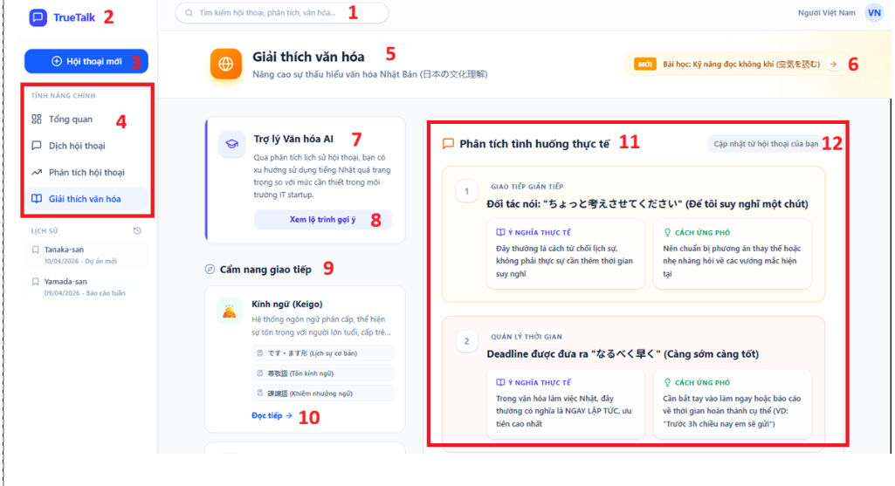

# ID4 Screen

## Purpose
This screen provides cultural explanations and learning guidance, including AI cultural assistance, recommended lessons, and scenario analysis.

## UI Elements and Behavior
| No | 項目名称 / Ten muc | 項目説明 / Mo ta | 分類 / Phan loai | 選択肢・入力値 / Lua chon - Gia tri nhap | 処理内容 / Xu ly | 備考 / Ghi chu |
| --- | --- | --- | --- | --- | --- | --- |
| 1 | 検索バー / Thanh tim kiem | 全体検索機能 / Chuc nang tim kiem tong the. | テキスト / Van ban | 任意のテキスト / Van ban bat ky | 入力されたキーワードで文化情報を検索する。 / Tim kiem thong tin van hoa theo tu khoa. | 入力欄に検索履歴がある / Co lich su tim kiem trong o nhap |
| 2 | アプリロゴ / Logo ung dung | ホームへの遷移 / Dieu huong ve trang chu. | 画像 / Hinh anh | なし / Khong | クリックするとダッシュボードへ戻る。 / Nhan de quay lai Dashboard. | "全画面共通 Dung chung cho toan he thong" |
| 3 | 新規会話ボタン / Nut Hoi thoai moi | 会話を開始するボタン / Nut bat dau cuoc hoi thoai. | ボタン / Nut bam | クリック / Nhan | 新しい対話画面へ遷移する。 / Dieu huong den man hinh doi thoai moi. | - |
| 4 | メインメニュー / Menu chinh | 機能ナビゲーション / Dieu huong tinh nang. | テキスト / Van ban | 文化 (Active) / Van hoa (Dang chon) | 各画面への遷移を制御する。 / Kiem soat dieu huong den cac man hinh. | - |
| 5 | 画面タイトル / Tieu de man hinh | 現在の画面名を表示 / Hien thi ten man hinh hien tai. | テキスト / Van ban | 文化を説明する / "Giai thich van hoa" | 画面の主目的と問題を表示する。 / Hien thi muc dich chinh va yeu to can luu y. | - |
| 6 | おすすめ学習ボタン / Nut bai hoc goi y | 推奨学習コンテンツ / Noi dung bai hoc de xuat. | ボタン / Nut bam | クリック / Nhan | 選択された文化学習ページへ遷移する。 / Chuyen den trang bai hoc van hoa da chon. | - |
| 7 | AI文化アシスタント / Tro ly Van hoa AI | AIによる分析提案 / De xuat phan tich AI. | カード / The | テキスト内容 / Noi dung van ban | ユーザーの傾向に基づいたアドバイスを表示。 / Hien thi loi khuyen dua tren xu huong cua nguoi dung. | - |
| 8 | 履歴表示ボタン / Nut xem lo trinh | 推奨ロードマップの表示 / Hien thi lo trinh de xuat. | ボタン / Nut bam | クリック / Nhan | パーソナライズされた学習計画を表示する。 / Hien thi ke hoach hoc tap ca nhan hoa. | - |
| 9 | コミュニケーションハンドブック / Cam nang giao tiep | 基礎知識の提供 / Cung cap kien thuc co ban. | 〇表示領域 / Vung hien thi | 知識項目 / Cac muc kien thuc | カテゴリ別の文化知識リストを表示する。 / Hien thi danh sach kien thuc van hoa theo danh muc. | - |
| 10 | 詳細リンク / Lien ket doc tiep | 詳細ページへの誘導 / Dan den trang chi tiet. | テキスト / Van ban | クリック / Nhan | 各項目の詳細解説ページへ遷移する。 / Dieu huong den trang giai thich chi tiet tung muc. | - |
| 11 | 状況分析領域 / Vung phan tich tinh huong | 実際の対話例の分析 / Phan tich cac vi du doi thoai thuc te. | 〇表示領域 / Vung hien thi | ケーススタディ / Cac tinh huong thuc te | 実際のフレーズの意味と対応策を表示する。 / Hien thi y nghia thuc te va cach ung pho cua cac cum tu. | "スクロール可能 Co the cuon" |
| 12 | 同期ボタン / Nut cap nhat tu hoi thoai | 会話データの同期 / Dong bo du lieu hoi thoai. | ボタン / Nut bam | クリック / Nhan | ユーザーの最新の会話から状況を抽出し、更新する。 / Trich xuat va cap nhat tinh huong tu hoi thoai moi nhat. | - |

## Notes
- The bilingual labels above reflect the original UI specification in the image.
- The cultural explanation area is scrollable and can contain multiple scenarios.
