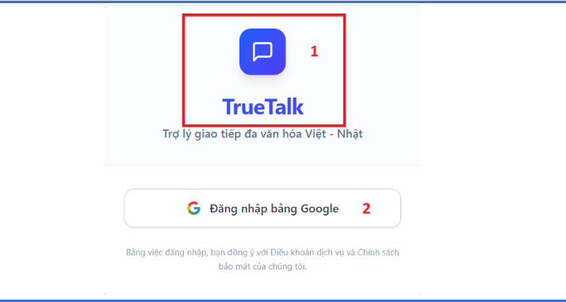

# ID5 Screen

## Purpose
This screen provides Google-based sign-in for the TrueTalk application and shows the app logo for branding and quick navigation.

## UI Elements and Behavior
| No | 項目名称 / Ten muc | 項目説明 / Mo ta | 分類 / Phan loai | 選択肢・入力値 / Lua chon - Gia tri nhap | 処理内容 / Xu ly | 備考 / Ghi chu |
| --- | --- | --- | --- | --- | --- | --- |
| 1 | Googleログイン / Dang nhap Google | Googleアカウントでログイン。 / Dang nhap bang tai khoan Google. | ボタン / Nut bam | - | Google OAuth認証を実行。 / Thuc hien xac thuc qua Google OAuth. | - |
| 2 | アプリロゴ / Logo ung dung | ホームへの遷移 / Dieu huong ve trang chu. | 画像 / Hinh anh | なし / Khong | クリックするとダッシュボードへ戻る。 / Nhan de quay lai Dashboard. | "全画面共通 Dung chung cho toan he thong" |

## Notes
- The bilingual labels above reflect the original UI specification in the image.
- Return paths from the dashboard are not shown on this screen.
