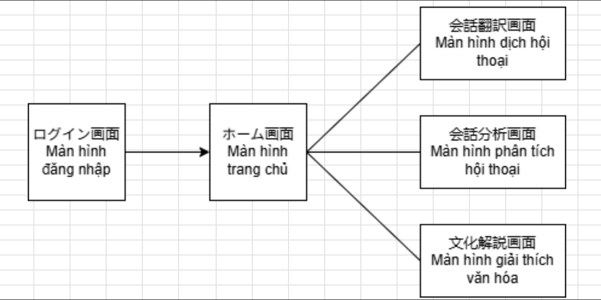

# Screen Transition Diagram

## Overview
The flow starts at the Login screen and moves to the Home screen after successful authentication. From Home, users can navigate to one of three feature screens.

## Screen Flow
1. Login -> Home
2. Home -> Conversation Translation
3. Home -> Conversation Analysis
4. Home -> Cultural Explanation

## Notes
- The diagram labels are bilingual (Japanese and Vietnamese), but this document uses English names.
- Navigation appears one-way from Home to feature screens; return paths are not shown.
